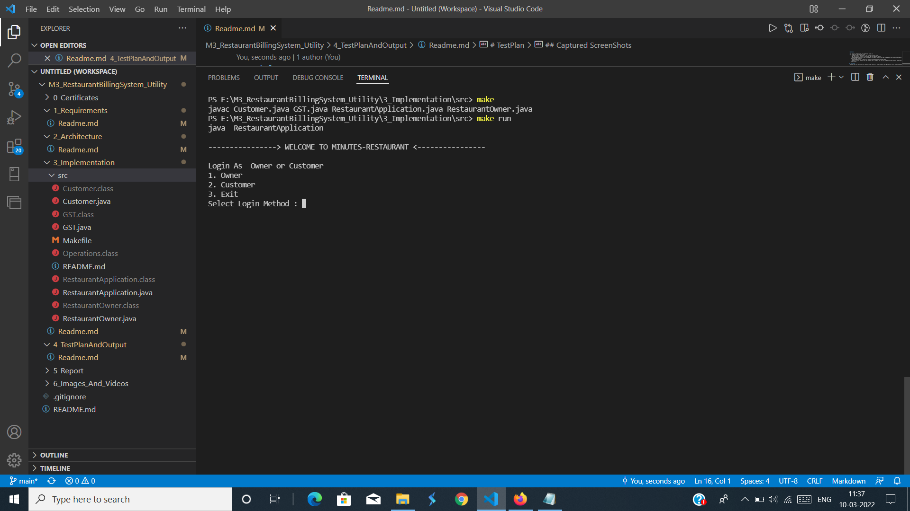
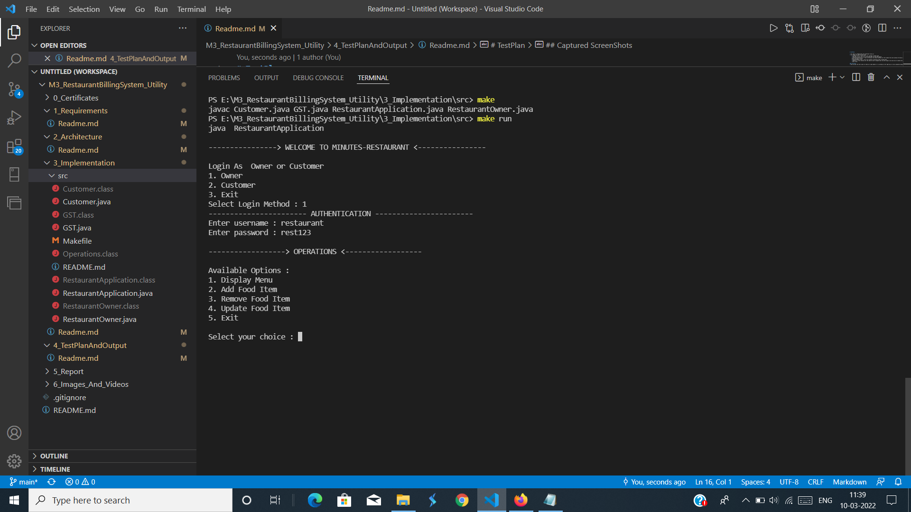
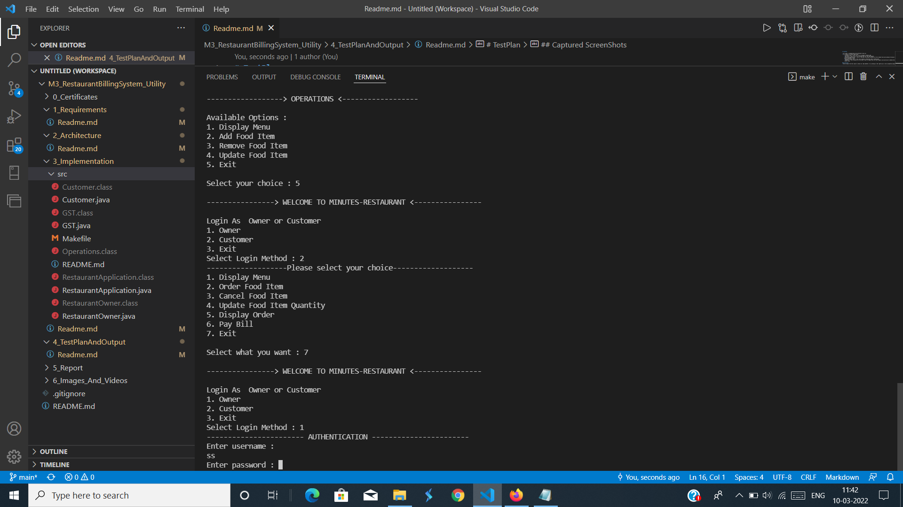
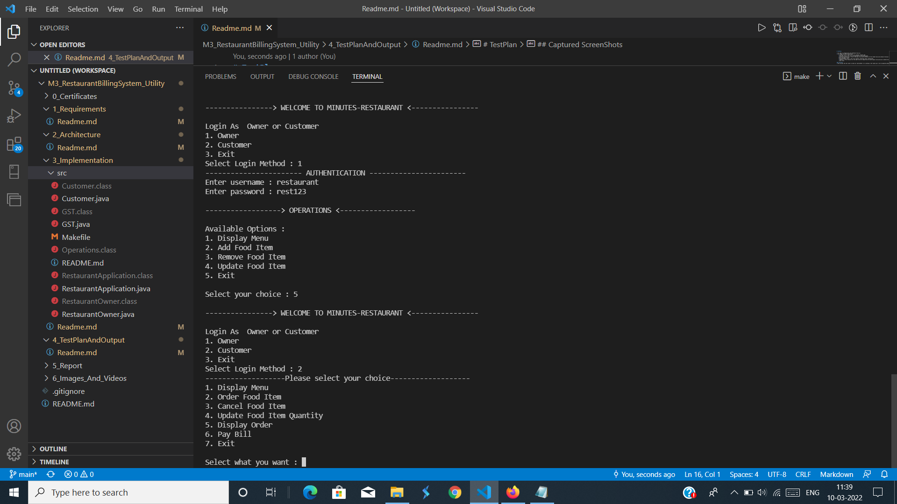

# TestPlan

* All code is categeroised into different files as:
* src folder for source code files
    * Customer.java -> this file is for customer related code
    * GST.java -> this file is to calculate GST for the food amount
    * RestaurantApplication -> This is the main file which contains all the linked files and contains the main code and how it starts and how it works
    * RestaurantOwner.java -> this file contains restaurant owner related data
    * Makefile -> this contains all the code to how to compile and run with single click and also to delete the unnecessary files as .class files

### Testcases 
* Here we pass the test cases to check our code whether it is working in the right way or not by expected outputs

## Captured ScreenShots

### OpenPage :

### Owner :

### Owner Credientials :

### Food :

# Table
* ID, Description of the test cases , input values , Expected Output, Actual output

| ID | Description | input values | Expected output | Actual Output |
|----|-------------|--------------|-----------------|---------------|
| `1` | Passing Owner and entering credientials  | username: restaurant, password: rest123 | open owner portal | opens owner portal |
| `2` | entering 2 which is customer | 2 | open customer portal | opened customer portal |
